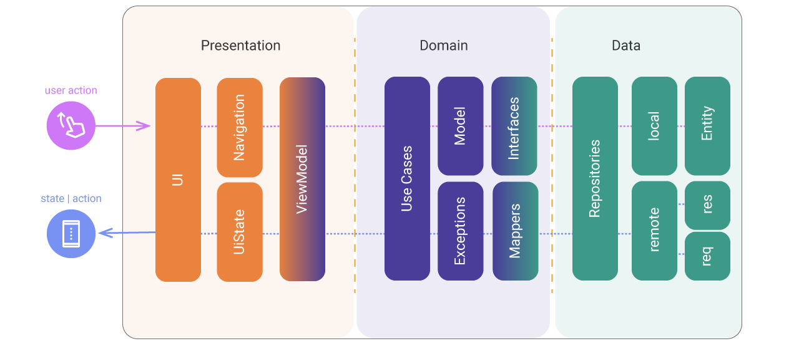
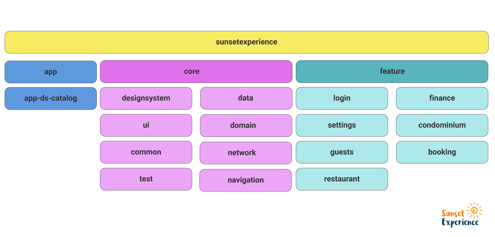

# sunsetexperience
An intuitive app to manage your temporary housing

## Arquitetura

### Modern App Architecture (MVVM + Clean Architecture)
This Modern App Architecture encourages using the following techniques, among others:

> - A reactive and layered architecture. 
> - Unidirectional Data Flow (UDF) in all layers of the app. 
> - A UI layer with state holders to manage the complexity of the UI. 
> - Coroutines and flows. 
> - Dependency injection best practices. 

Above is the Clean Architecture flow that shows how the data is requested until data is presented. 
Clean Architecture divided into 3 layers: (Presentation - Domain - Data) 

  

### Modules
Above is shown the multiples modules
> The concept this project is based feature module

  

