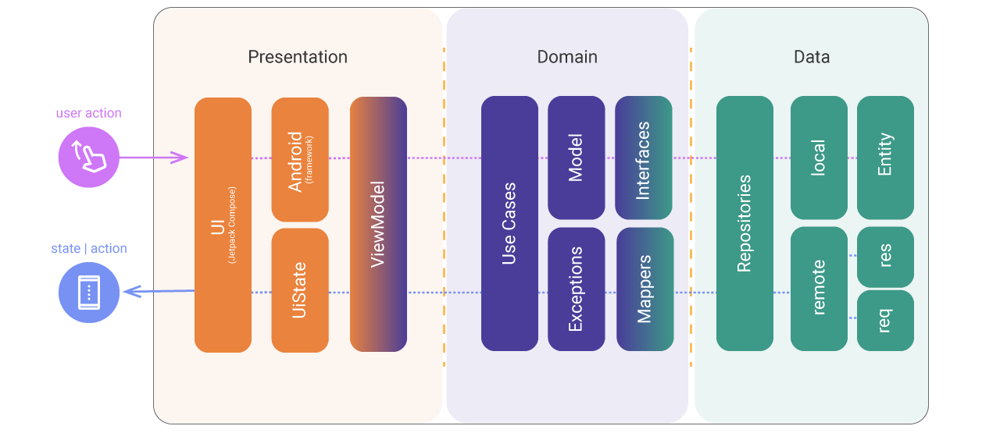

# sunsetexperience
An intuitive app to manage your temporary housing

## Architecture

### Modern App Architecture (MVVM + Clean Architecture)
This project are using the following google techniques recommendations:

> - A reactive and layered architecture. 
> - Unidirectional Data Flow (UDF) in all layers of the app. 
> - A UI layer with state holders to manage the complexity of the UI. 
> - Coroutines and flows. 
> - Dependency injection best practices. 

Above is the Clean Architecture flow that shows how the data is requested until data is presented. 
Clean Architecture divided into 3 layers: (Presentation - Domain - Data) 

  

### Modules
Above is shown the multiples modules
> The concept of this project is based feature module, can you see at diagram below:

  

### Setup
Pre push Git Hooks
> Add file pre-push at directory <b>.git/hooks<b/> to configure ktlint and deteKt checks before push

  

